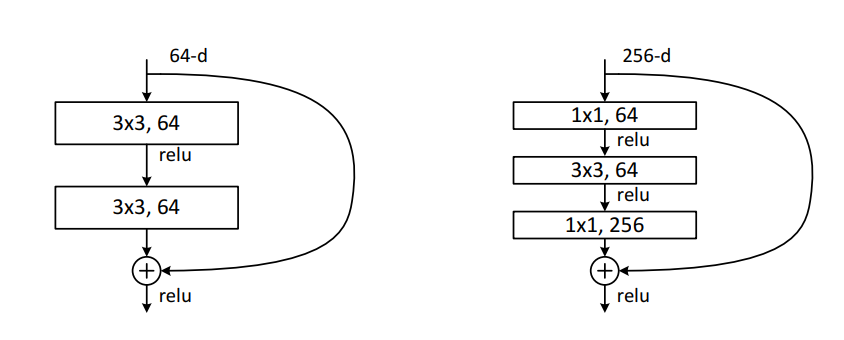
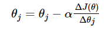
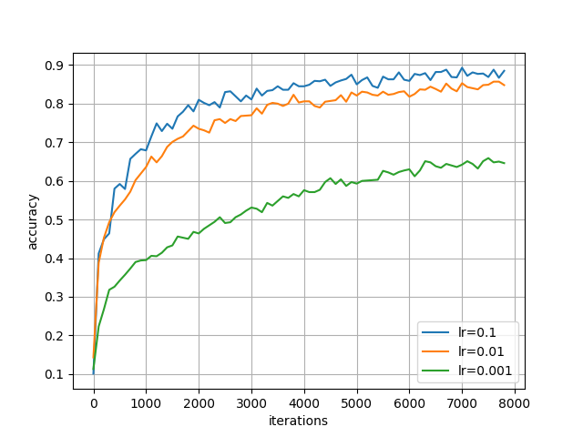
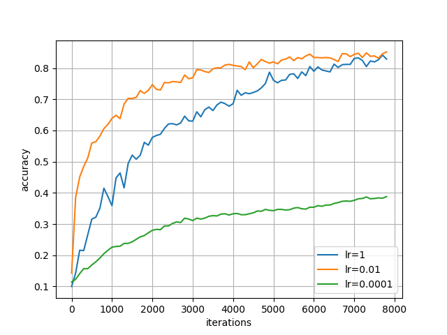
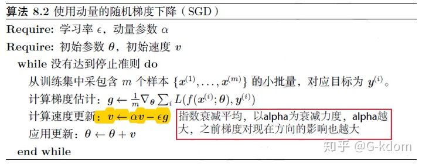
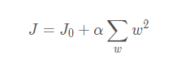
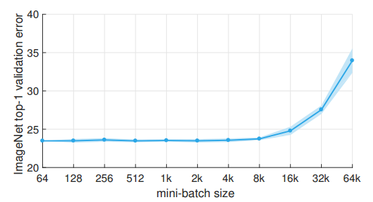
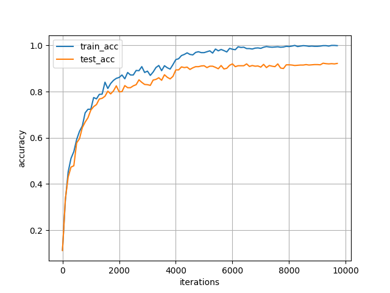
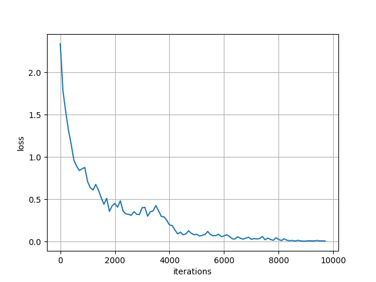

# 人工智能安全——深度学习超参数研究

本项目搭建了 ResNet18、VGG16 等网络对 CIFAR10 数据集进行图像分类任务训练，并在此基础上研究了 **学习率、Momentum、L2 Regularization** 等超参数对训练实际表现的影响，之后研究了超参数之间的关联性与调参配置优化问题。


目录
=================

   * [简介](#简介)
   * [模型架构](#网络架构)
   * [实验环境](#实验环境)
   * [超参数的影响](#超参数的影响)
     * [学习率](#学习率)
     * [Momentum&L2](#Momentum&L2)
   * [关联性与调参建议](#关联性与调参建议)
     * [Batch_size、epoch与学习率](#Batch_size、epoch与学习率)
     * [学习率衰减](#学习率衰减) 
     * [优化器设置](#优化器设置) 
   * [总结](#总结)
   * [参考文献](#参考文献)


## 简介

本项目使用了 Pytorch 框架，搭建了 **ResNet-18** 和 VGG16 网络并对 CIFAR10 数据集进行图像分类任务的训练与测试，获得了 92.34% 的准确率。

随后，将 **ResNet-18** 网络模型作为 Baseline 模型，通过对一些超参数进行调整，研究 **学习率、Momentum、Weight_decay** 等一系列超参数对训练表现的影响。

除此之外，本项目还对各个超参数之间的关联性及参数优化策略进行了研究探讨，例如学习率偏大或偏小时，对 epoch 或 batch size 等的调优策略，对优化器参数的调参建议以及依托经验的参数选择。


### 模型结构

本项目的 baseline 模型基于 [ResNet-18](https://arxiv.org/pdf/1512.03385.pdf)，其主要目的是为了解决网络深度加深时，模型出现梯度消失，从而能力退化的问题。ResNet 通过在残差块的输入和输出之间增设一条 shortcut 连接，可以直接在层与层之间或多层之间建立直接联系，不会因为层数过深而出现梯度消失。实现的代码实现通过在 [Pytorch](https://github.com/pytorch/vision/blob/master/torchvision/models/resnet.py) 的 ResNet 官方实现上修改得到。

<div align="center">
  
</div>

[VGG16](https://arxiv.org/abs/1409.1556) 的出现在 ResNet 之前，在本次实验中作为 ResNet 模型的对比组出现。

实验结果如下：


| 模型 | 准确率 |
|----|---|
| **ResNet-18** | **92.3%** |
| VGG-16 | 90.7% |


## 实验环境

实验环境依托于腾讯云平台 (实验室服务器坏掉了)。

### 1、系统环境
* Ubuntu Server 20.04
* GPU NVIDIA T4
* CUDA 10.2
* cuDNN 8.1.0
* Python 3.8
  
### 2、python环境
* Pytorch 1.9.1
* matplotlib
* scipy


## 超参数的影响

为方便管理，将网络模型写入 `model.py`，训练过程写在 `train.py`。

为方便超参数的修改，使用 `argparse` 对超参数修改，便于后续实验进行。

```bash
parser.add_argument('--epochs', type=int, default=100, help="epochs")
parser.add_argument('--lr', type=float, default=0.1, help="learning rate")
parser.add_argument('--batch_size', type=int, default=128, help="batch size")
parser.add_argument('--momentum', type=float, default=0.9, help="momentum")
parser.add_argument('--weight_decay', type=float, default=5e-4, help="L2")
```

### 学习率

学习率肯定是深度学习模型中最最重要的超参数了，其数值的大小直接影响到模型训练的效果，其发挥作用的主要形式如下：

<div align="center">
  
</div>

#### 实验一

为了比对不同学习率对模型训练的影响，我们设置 learning rate 分别等于 0.1、0.01 以及 0.001 三组实验，各自训练 20 epochs，总计 7800  iterations，之后根据测试集上的准确率，得到如下实验结果：

<div align="center">
  
</div>

由实验结果可见，对于较大的学习率(lr=0.1)，模型会有更快的收敛速度；相反对于较小的学习率，收敛速度则没那么快(lr=0.01)。在损失函数上的表现也是如此。

#### 实验二
实验二测试了lr=1、0.01以及0.0001的情况，用于测试不合理参数大小的影响：

<div align="center">
  
</div>

可见当学习率取1时，不仅没有更快的收敛速度，而且精确度表现也不佳，推测是因为学习率设置过大，容易在局部最小值点周围震荡，影响模型收敛的速度；而学习率极小时，同样也会遇到收敛慢的问题。

### Momentum&L2

#### Momentum

Momentum(动量)，作为 SGD 的一种加速策略，被 Pytorch 封装进了 SGD 的优化器设置中，其内容具体如下：

<div align="center">
  
</div>

简而言之就是每次对参数进行更新时，都会再考量一个 ν 的动量，这个动量通过参数加权平均了之前的梯度，结果就是使参数更新可以带上先前梯度信息的惯性，可以更快收敛。具体其优点有：
* 能通过局部极小点；
* 更快的收敛速度；
* 减少更新时的震荡...

#### Weight_decay

即L2正则化，同样被 Pytorch 封装进了 SGD 的优化器中，可以通过 Weight_decay 调整L2正则的惩罚力度。

<div align="center">
  
</div>

具体方法就是在损失函数后添加模型参数的2范数，对模型参数的大小进行惩罚，以此减小参数的规模，一定程度防止过拟合。

#### 实验

## 关联性与调参建议
### Batch_size、epoch与学习率

众所周知，每个 epoch 中 iteration 的数量取决于数据集大小和 batch size 大小 (iterations = len(dataset) / batch size)，而 iteration 的数量才是模型在训练时真正做反向传播并更新梯度的次数，而不是 epoch 的大小。

故我们使用较小学习率时，需要更多的迭代次数，既可以增加 epoch 的数量，也可以减小 batch size 的数量，由此来获得更大的迭代次数。

值得注意的是，batch size 的取值也不宜过小，这首先是会造成过长的训练时间，并且计算梯度的泛化性能也不能得到保障；与此同时 batch size也不宜太大，不仅 GPU 显存会有过大压力，当 batch size 过大时，模型同样也会失去泛化能力[3]。

<div align="center">
  
</div>

### 学习率衰减
不同的学习率大小有着不同的优点和缺点，有一个更优的方法是学习率衰减策略，在 pytorch 中使用 lr_scheduler 实现：
```bash
scheduler = optim.lr_scheduler.MultiStepLR(optimizer, milestones=[20, 30], gamma=0.1)
```
即在训练初期，使用较大的学习率，快速接近优化目标，在训练中后期，不断衰减学习率，使用较小的学习率，使模型精准接近优化的最优点。
<div align="center">
  
  
</div>
使用学习率衰减策略的训练效果如图，可见在训练中期，约 4000 iterations，准确率会有一个小跃迁，就是学习率衰减所导致的，成功使模型获得更好的效果。

### 优化器设置

在 Pytorch 里，对动量momentum和L2正则weight_decay的设置位于SGD优化器的参数设置之中：
```bash
optimizer = optim.SGD(net.parameters(), lr=args.lr, momentum=0.9, weight_decay=5e-4)
```
这其中对动量和L2的数量大小，不同于之前的超参数设置，大多是凭经验选择的，例如代码中取 momentum=0.9，weight_decay=5e-4 (L2) 即是经典的取值数字。

## 总结
本项目通过实验的方法，得知了不同学习率对模型训练的影响，以及动量SGD对模型训练的加速作用。在此基础上，又对超参数之间的关联做了一些总结，并根据超参数之间的关联性给出一部分超参数调参的建议。

## 参考文献

[1] [Deep Residual Learning for Image Recognition](https://arxiv.org/pdf/1512.03385.pdf)

[2] [Very Deep Convolutional Networks for Large-Scale Image Recognition](https://arxiv.org/abs/1409.1556)

[3] [Large Minibatch SGD: Training ImageNet in 1 Hour](https://arxiv.org/abs/1706.02677)